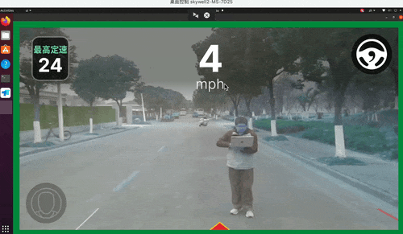

# Customize Your Openpilot
|English|[中文版](./README_zh.md)|
## Introduction
This project migrates the openpilot system from a simulated environment to a real vehicle environment. Unlike the original openpilot, which only supports specific brands and models of vehicles, by customizing the sensor integration and control interface [middleware](./bridge/metadrive/middleware.py), we can extend openpilot as a backend to **ANY** type of vehicle, offering rich and flexible customization options.

<div style="display: flex; justify-content: space-between;">
    <div style="width: 32%; text-align: center;">
        <div style="font-size: 1.5rem; font-weight: bold;">Straight Driving</div>
        
    </div>
    <div style="width: 32%; text-align: center;">
        <div style="font-size: 1.5rem; font-weight: bold;">Sharp Turning</div>
        
    </div>
    <div style="width: 32%; text-align: center;">
        <div style="font-size: 1.5rem; font-weight: bold;">Pedestrian Avoidance</div>
        
    </div>
</div>

## Quick Start

1. Download and compile [openpilot](https://github.com/commaai/openpilot)
2. Replace the `tools/sim` folder in openpilot with the folder from this project
3. Adapt your underlying chassis driver by modifying the `def send(self, vc):` function in the [middleware](./bridge/metadrive/middleware.py) code

4. Start openpilot
    ``` bash
    # Run locally
    ./tools/sim/launch_openpilot.sh
    ```

5. Start the Bridge
    ```
    $ ./run_bridge.py -h
    ```

## Customization Details

The original openpilot interacts with the MetaDrive simulator through the bridge module to obtain sensor data from the virtual environment and send control commands. In a real environment, we need to replace this MetaDrive adaptation layer and establish a communication interface with the actual hardware.

If you have a new vehicle, you need to modify:

```shell
- bridge/metadrive
   |- middleware.py # Customize your chassis control, IMU, and CAN message reading methods       
   |- realdrive_bridge.py  
   |- realdrive_common.py  
   |- realdrive_process.py # Enable the camera
   |- realdrive_world.py
```

## Customize Your Chassis Control, IMU, and CAN Message Reading Methods     
First, you need to modify the CAN message reading and sending paths according to the actual hardware configuration. Typically, CAN messages are communicated via Unix Socket or serial port.
### 1. Modify CAN Message Reading and Sending Paths
middleware.py

```python
## Control and collect CAN messages
line 12:  >>
SOCKET_PATH = "/tmp/can_read_socket"
SEND_PATH = "/tmp/can_socket"

## Collect IMU data 
line 45:  >>
sp = serial.Serial()
sp.port = "/dev/ttyUSB0"  # Set the serial port communication interface
sp.baudrate = 115200  # Set the baud rate
```
To help you customize the `middleware.py` file, here are some key steps and code examples to help you implement the communication interface with the actual hardware. We will focus on how to modify the `middleware.py` file to adapt to new vehicle hardware.

### 2. Configure Serial Communication

If your hardware uses serial communication (e.g., IMU data), you need to configure the serial port parameters, such as port number, baud rate, etc.

```python

# Configure serial communication
sp = serial.Serial()
sp.port = "/dev/ttyUSB0"  # Set the serial port communication interface
sp.baudrate = 115200      # Set the baud rate
sp.bytesize = serial.EIGHTBITS  # Data bits
sp.parity = serial.PARITY_NONE  # Parity bit
sp.stopbits = serial.STOPBITS_ONE  # Stop bits
sp.timeout = 0  # Set the timeout in seconds
```

### 3. Parse CAN Messages

Define parsing rules according to your vehicle's CAN protocol. Here is an example showing how to parse CAN messages.

```python
# middleware.py

# Define CAN message parsing rules
self.parse_rules = {
    "0x1806a0b0": [
        {
            "name": "vehicle_speed",
            "start_bit": 16,
            "length": 8,
            "factor": 1,
            "offset": -50,
        },
        {
            "name": "battery",
            "start_bit": 24,
            "length": 8,
            "factor": 0.5,
            "offset": 0,
        },
    ],
    "0x1802a0b0": [
        {
            "name": "steering_angle",
            "start_bit": 32,
            "length": 8,
            "factor": 1,
            "offset": -42,
        },
    ],
}
```

### 4. Send Control Commands

Send control commands (e.g., steering angle, throttle) according to the vehicle's control protocol.

```python
# middleware.py

def send(self, vc):
    """
    Send control commands to the environment. vc = [steer, gas]
    """
    try:
        steer, gas = vc

        # Prioritize sending manual control commands
        if self.keyboard_override:
            steer = self._wheel_angle  # Direction from GUI or keyboard
            gas = self._target_speed   # Speed adjustment from GUI or keyboard
        else:
            # Use automatic commands (from vehicle state)
            gas = self.vehicle_speed

        # Generate control messages and send
        msg_steer = f"send 402763936 32 8 {format(abs(int(-(steer - 0.4) * 2 + 42)), '08b')}\n"
        msg_gas = f"send 402895008 0 8 {format(abs(int(gas * 2)), '08b')}\n"
        self.send_socket.send(msg_steer.encode())
        self.send_socket.send(msg_gas.encode())

    except Exception as e:
        print(f"Failed to send control commands: {e}")
```

### 5. Read and Process IMU Data

If your vehicle is equipped with an IMU (Inertial Measurement Unit), you need to read IMU data from the serial port and process it.

```python
# middleware.py

def _serial_reader(self):
    """
    Read the latest line of IMU data from the serial port and update it in memory, using a non-blocking approach, ignoring all lines except the last one.
    """
    buffer_str = ""
    while self.running:
        try:
            n = self.sp.in_waiting
            if n > 0:
                # Read all available data and convert to string
                raw_data = self.sp.read(n).decode(errors="ignore")
                buffer_str += raw_data
                # If a newline appears, only parse the last line
                if "\n" in buffer_str:
                    # Use rsplit to split the buffer by line, only take the last line
                    *_, last_line = buffer_str.strip().rsplit("\n", 1)
                    # Clear the buffer to avoid processing old data in the next read
                    buffer_str = ""
                    imu_data = last_line.split(",")

                    if len(imu_data) == 16:
                        imu_data = {
                            "heading": float(imu_data[3]),
                            "pitch": float(imu_data[4]),
                            "roll": float(imu_data[5]),
                            "lat": float(imu_data[6]),
                            "lon": float(imu_data[7]),
                            "alti": float(imu_data[8]),
                            "ve": float(imu_data[9]),
                            "vn": float(imu_data[10]),
                            "vu": float(imu_data[11]),
                        }
                        # Calculate velocity components
                        vx = imu_data["vn"] * math.cos(math.radians(imu_data["heading"])) + imu_data["ve"] * math.sin(math.radians(imu_data["heading"]))
                        vy = imu_data["vn"] * math.sin(math.radians(imu_data["heading"])) - imu_data["ve"] * math.cos(math.radians(imu_data["heading"]))
                        imu_data["vx"] = vx
                        imu_data["vy"] = vy
                        with self.lock:
                            self.data.update(imu_data)
        except Exception as e:
            print(f"Serial read error: {e}")
            traceback.print_exc()
```

## Configure Your Camera
To add camera configuration to your code, we need to ensure that the camera can be correctly initialized, capture images, and pass them to subsequent processing modules. Here are the detailed steps and code implementation:

---

### 1. **Camera Initialization**
In the `init_cameras` function, initialize two cameras (main camera and wide-angle camera) and set their resolution and frame rate.

```python
def init_cameras():
    # Initialize the main camera
    cap_road = cv2.VideoCapture(0)
    if not cap_road.isOpened():
        raise ValueError("Cannot open camera at index 0")
    cap_road.set(cv2.CAP_PROP_FRAME_WIDTH, 1928)
    cap_road.set(cv2.CAP_PROP_FRAME_HEIGHT, 1208)
    cap_road.set(cv2.CAP_PROP_FPS, 30)

    # Initialize the wide-angle camera
    cap_wide = cv2.VideoCapture(2)
    if not cap_wide.isOpened():
        raise ValueError("Cannot open camera at index 2")
    cap_wide.set(cv2.CAP_PROP_FRAME_WIDTH, 1928)
    cap_wide.set(cv2.CAP_PROP_FRAME_HEIGHT, 1208)
    cap_wide.set(cv2.CAP_PROP_FPS, 30)

    # Create asynchronous capture objects
    async_cap_road = AsyncVideoCapture(cap_road, "rgb_road", (1208, 1928))
    async_cap_wide = AsyncVideoCapture(cap_wide, "rgb_wide", (1208, 1928))

    return async_cap_road, async_cap_wide
```

---

### 2. **Asynchronous Video Capture**
Use the `AsyncVideoCapture` class to implement asynchronous video capture, ensuring that camera frame reading does not block the main thread.

```python
class AsyncVideoCapture:
    def __init__(self, cap, name, target_shape):
        self.cap = cap
        self.name = name
        self.target_shape = target_shape
        self.queue = queue.Queue(maxsize=4)  # Limit the queue size to 4
        self.stopped = False

        # Start the asynchronous reading thread
        self.thread = threading.Thread(target=self._reader)
        self.thread.daemon = True
        self.thread.start()

    def _reader(self):
        while not self.stopped:
            ret, frame = self.cap.read()
            if not ret:
                self.stopped = True
                break

            # Resize
            if self.name == "rgb_wide":
                frame = cv2.flip(frame, -1)
            frame = cv2.resize(frame, (self.target_shape[1], self.target_shape[0]))

            # If the queue is full, remove the old frame
            if self.queue.full():
                try:
                    self.queue.get_nowait()
                except queue.Empty:
                    pass

            self.queue.put(frame)

    def read(self):
        return True, self.queue.get()

    def release(self):
        self.stopped = True
        self.thread.join()
        self.cap.release()
```

---

### 3. **Get Camera Frame**
In the `get_cam_as_rgb` function, capture a frame from the camera and convert it to RGB format.

```python
def get_cam_as_rgb(cap_name):
    time_past = time.time()
    if cap_name == "rgb_road":
        cap = async_cap_road
        target_shape = (1208, 1928)
    elif cap_name == "rgb_wide":
        cap = async_cap_wide
        target_shape = (1208, 1928)

    ret, frame = cap.read()
    if not ret:
        raise RuntimeError("Failed to read frame from camera")

    frame = cv2.resize(frame, (target_shape[1], target_shape[0]))
    time_past = time.time() - time_past
    return cv2.cvtColor(frame, cv2.COLOR_BGR2RGB)
```

---

### 4. **Camera Processing in the Main Loop**
In the main loop, periodically capture frames from the camera and update them in shared memory.

```python
while not exit_event.is_set():
    gui_controller.update_property_display()
    dpg.render_dearpygui_frame()

    # Update vehicle state
    vehicle_state = realdrive_vehicle_state(
        velocity=vec3(
            x=float(env.vector_velocity[0]), y=float(env.vector_velocity[1]), z=0
        ),
        position=env.postion,
        bearing=float(env.heading),
        steering_angle=env.steering_angle,
    )
    vehicle_state_send.send(vehicle_state)

    # Process control commands
    if controls_recv.poll(0):
        while controls_recv.poll(0):
            steer_angle, gas, should_reset = controls_recv.recv()

        steer_metadrive = steer_angle * 1 / (20)
        vc = [steer_metadrive, gas]

        if should_reset:
            lane_idx_prev = reset()
            start_time = None

    # Check if autonomous driving is enabled
    is_engaged = op_engaged.is_set()
    if is_engaged and start_time is None:
        start_time = time.monotonic()

    # Update camera images every 5 frames
    if rk.frame % 5 == 0:
        env.send(vc)
        timeout = (
            True
            if start_time is not None
            and time.monotonic() - start_time >= test_duration
            else False
        )

        # Update wide-angle camera image
        if dual_camera:
            wide_road_image[...] = get_cam_as_rgb("rgb_wide")
        # Update main camera image
        road_image[...] = get_cam_as_rgb("rgb_road")
        image_lock.release()

    rk.keep_time()
```

---

### 5. **Resource Release**
Ensure that camera resources are properly released when the program ends.

```python
finally:
    async_cap_road.release()
    async_cap_wide.release()
    gui_controller.cleanup()
```

---

### 6. **Test the Camera**
In `__main__`, you can add test code to verify that the camera is working correctly.

```python
if __name__ == "__main__":
    async_cap_road, async_cap_wide = init_cameras()
    try:
        while True:
            ret, frame = async_cap_road.read()
            if not ret:
                break
            cv2.imshow("Road Camera", frame)

            ret, frame = async_cap_wide.read()
            if not ret:
                break
            cv2.imshow("Wide Camera", frame)

            if cv2.waitKey(1) & 0xFF == ord('q'):
                break
    finally:
        async_cap_road.release()
        async_cap_wide.release()
        cv2.destroyAllWindows()
```