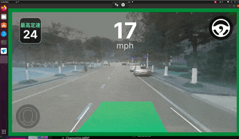
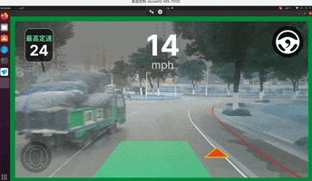
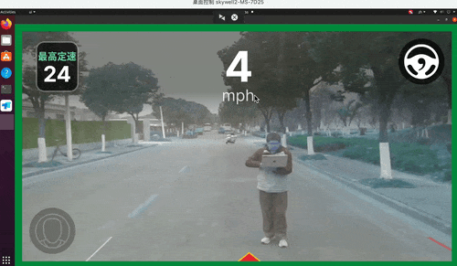

# 定制你的 openpilot 


## 介绍
本项目将 openpilot 系统从模拟环境迁移到真实车辆环境。
不同于原版 openpilot 仅支持特定品牌和型号的车辆，通过自定义传感器接入和控制接口的[中间层](./bridge/metadrive/middleware.py)，我们可以将 openpilot 作为后端扩展到任意类型的车辆上，并提供了丰富灵活的定制方式


<div style="display: flex; justify-content: space-between;">
    <div style="width: 32%; text-align: center;">
        <div style="font-size: 1.5rem; font-weight: bold;">直线行驶</div>
        
    </div>
    <div style="width: 32%; text-align: center;">
        <div style="font-size: 1.5rem; font-weight: bold;">大角度转向</div>
        
    </div>
    <div style="width: 32%; text-align: center;">
        <div style="font-size: 1.5rem; font-weight: bold;">行人避障</div>
        
    </div>
</div>


## 快速开始

1. 下载并编译 [openpilot](https://github.com/commaai/openpilot)
2. 将本项目文件夹替换掉 openpilot 的`tools/sim` 文件夹
3. 适配你的底层底盘驱动，修改 [middleware](./bridge/metadrive/middleware.py) 代码的 `def send(self, vc):` 函数

4. 开启 openpilot
    ``` bash
    # Run locally
    ./tools/sim/launch_openpilot.sh
    ```

5. 开启 Bridge
    ```
    $ ./run_bridge.py -h
    ```

## 定制细节

原版 openpilot 通过 bridge 模块与 MetaDrive 模拟器进行交互，获取虚拟环境中的传感器数据并发送控制指令。在真实环境中，我们需要替换这个metadrive 适配层，建立与实际硬件的通信接口。

如果有新的车，你需要修改:

```shell
- bridge/metadrive
   |- middleware.py # 定制你的底盘控制、IMU、CAN信息读取方法       
   |- realdrive_bridge.py  
   |- realdrive_common.py  
   |- realdrive_process.py # 打开摄像头
   |- realdrive_world.py
```

## 定制你的底盘控制、IMU、CAN信息读取方法     
首先，你需要根据实际硬件的配置，修改 CAN 信息的读取和发送路径。通常，CAN 信息通过 Unix Socket 或串口进行通信。
### 1. 修改 CAN 信息读取和发送路径
middleware.py

```python
## 控制和收集CAN 信息
line 12:  >>
SOCKET_PATH = "/tmp/can_read_socket"
SEND_PATH = "/tmp/can_socket"

## 收集IMU 信息 
line 45:  >>
sp = serial.Serial()
sp.port = "/dev/ttyUSB0"  # 设置串口通信接口
sp.baudrate = 115200  # 设置波特率
```
为了帮助你定制 `middleware.py` 文件，以下是一些关键步骤和代码示例，帮助你实现与实际硬件的通信接口。我们将重点关注如何修改 `middleware.py` 文件，以适应新的车辆硬件。

### 2. 配置串口通信

如果你的硬件使用串口通信（例如 IMU 数据），你需要配置串口的参数，如端口号、波特率等。

```python

# 配置串口通信
sp = serial.Serial()
sp.port = "/dev/ttyUSB0"  # 设置串口通信接口
sp.baudrate = 115200      # 设置波特率
sp.bytesize = serial.EIGHTBITS  # 数据位
sp.parity = serial.PARITY_NONE  # 校验位
sp.stopbits = serial.STOPBITS_ONE  # 停止位
sp.timeout = 0  # 设置超时时间，单位：秒
```

### 3. 解析 CAN 信息

根据你的车辆 CAN 协议，定义解析规则。以下是一个示例，展示了如何解析 CAN 信息。

```python
# middleware.py

# 定义 CAN 信息解析规则
self.parse_rules = {
    "0x1806a0b0": [
        {
            "name": "vehicle_speed",
            "start_bit": 16,
            "length": 8,
            "factor": 1,
            "offset": -50,
        },
        {
            "name": "battery",
            "start_bit": 24,
            "length": 8,
            "factor": 0.5,
            "offset": 0,
        },
    ],
    "0x1802a0b0": [
        {
            "name": "steering_angle",
            "start_bit": 32,
            "length": 8,
            "factor": 1,
            "offset": -42,
        },
    ],
}
```

### 4. 发送控制指令

根据车辆的控制协议，发送控制指令（如方向盘角度、油门等）。

```python
# middleware.py

def send(self, vc):
    """
    发送控制指令到环境中。vc = [steer, gas]
    """
    try:
        steer, gas = vc

        # 优先发送手动控制指令
        if self.keyboard_override:
            steer = self._wheel_angle  # 来自 GUI 或键盘的方向
            gas = self._target_speed   # 来自 GUI 或键盘的速度调整
        else:
            # 使用自动指令（来自车辆状态）
            gas = self.vehicle_speed

        # 生成控制消息并发送
        msg_steer = f"send 402763936 32 8 {format(abs(int(-(steer - 0.4) * 2 + 42)), '08b')}\n"
        msg_gas = f"send 402895008 0 8 {format(abs(int(gas * 2)), '08b')}\n"
        self.send_socket.send(msg_steer.encode())
        self.send_socket.send(msg_gas.encode())

    except Exception as e:
        print(f"发送控制指令失败: {e}")
```

### 5. 读取和处理 IMU 数据

如果你的车辆配备了 IMU（惯性测量单元），你需要从串口读取 IMU 数据并进行处理。

```python
# middleware.py

def _serial_reader(self):
    """
    从串口读取最新的一行 IMU 数据并更新到内存中，采用非阻塞方式，忽略除最后一行之外的所有行。
    """
    buffer_str = ""
    while self.running:
        try:
            n = self.sp.in_waiting
            if n > 0:
                # 读取所有可用数据并转为字符串
                raw_data = self.sp.read(n).decode(errors="ignore")
                buffer_str += raw_data
                # 如果出现换行，则只解析最后一行
                if "\n" in buffer_str:
                    # 使用 rsplit 将缓冲区按行分割，只取最后一行
                    *_, last_line = buffer_str.strip().rsplit("\n", 1)
                    # 清空 buffer，让下次读取时不重复处理老数据
                    buffer_str = ""
                    imu_data = last_line.split(",")

                    if len(imu_data) == 16:
                        imu_data = {
                            "heading": float(imu_data[3]),
                            "pitch": float(imu_data[4]),
                            "roll": float(imu_data[5]),
                            "lat": float(imu_data[6]),
                            "lon": float(imu_data[7]),
                            "alti": float(imu_data[8]),
                            "ve": float(imu_data[9]),
                            "vn": float(imu_data[10]),
                            "vu": float(imu_data[11]),
                        }
                        # 计算速度分量
                        vx = imu_data["vn"] * math.cos(math.radians(imu_data["heading"])) + imu_data["ve"] * math.sin(math.radians(imu_data["heading"]))
                        vy = imu_data["vn"] * math.sin(math.radians(imu_data["heading"])) - imu_data["ve"] * math.cos(math.radians(imu_data["heading"]))
                        imu_data["vx"] = vx
                        imu_data["vy"] = vy
                        with self.lock:
                            self.data.update(imu_data)
        except Exception as e:
            print(f"Serial read error: {e}")
            traceback.print_exc()
```

## 配置你的摄像头
为了在你的代码中添加摄像头配置，我们需要确保摄像头能够正确初始化、捕获图像，并将其传递给后续的处理模块。以下是详细的步骤和代码实现：

---

### 1. **摄像头初始化**
在 `init_cameras` 函数中，初始化两个摄像头（主摄像头和广角摄像头），并设置其分辨率和帧率。

```python
def init_cameras():
    # 初始化主摄像头
    cap_road = cv2.VideoCapture(0)
    if not cap_road.isOpened():
        raise ValueError("Cannot open camera at index 0")
    cap_road.set(cv2.CAP_PROP_FRAME_WIDTH, 1928)
    cap_road.set(cv2.CAP_PROP_FRAME_HEIGHT, 1208)
    cap_road.set(cv2.CAP_PROP_FPS, 30)

    # 初始化广角摄像头
    cap_wide = cv2.VideoCapture(2)
    if not cap_wide.isOpened():
        raise ValueError("Cannot open camera at index 2")
    cap_wide.set(cv2.CAP_PROP_FRAME_WIDTH, 1928)
    cap_wide.set(cv2.CAP_PROP_FRAME_HEIGHT, 1208)
    cap_wide.set(cv2.CAP_PROP_FPS, 30)

    # 创建异步捕获对象
    async_cap_road = AsyncVideoCapture(cap_road, "rgb_road", (1208, 1928))
    async_cap_wide = AsyncVideoCapture(cap_wide, "rgb_wide", (1208, 1928))

    return async_cap_road, async_cap_wide
```

---

### 2. **异步视频捕获**
使用 `AsyncVideoCapture` 类实现异步视频捕获，确保摄像头帧的读取不会阻塞主线程。

```python
class AsyncVideoCapture:
    def __init__(self, cap, name, target_shape):
        self.cap = cap
        self.name = name
        self.target_shape = target_shape
        self.queue = queue.Queue(maxsize=4)  # 限制队列大小为4
        self.stopped = False

        # 启动异步读取线程
        self.thread = threading.Thread(target=self._reader)
        self.thread.daemon = True
        self.thread.start()

    def _reader(self):
        while not self.stopped:
            ret, frame = self.cap.read()
            if not ret:
                self.stopped = True
                break

            # 调整尺寸
            if self.name == "rgb_wide":
                frame = cv2.flip(frame, -1)
            frame = cv2.resize(frame, (self.target_shape[1], self.target_shape[0]))

            # 如果队列满了，移除旧帧
            if self.queue.full():
                try:
                    self.queue.get_nowait()
                except queue.Empty:
                    pass

            self.queue.put(frame)

    def read(self):
        return True, self.queue.get()

    def release(self):
        self.stopped = True
        self.thread.join()
        self.cap.release()
```

---

### 3. **获取摄像头帧**
在 `get_cam_as_rgb` 函数中，从摄像头捕获帧并将其转换为 RGB 格式。

```python
def get_cam_as_rgb(cap_name):
    time_past = time.time()
    if cap_name == "rgb_road":
        cap = async_cap_road
        target_shape = (1208, 1928)
    elif cap_name == "rgb_wide":
        cap = async_cap_wide
        target_shape = (1208, 1928)

    ret, frame = cap.read()
    if not ret:
        raise RuntimeError("Failed to read frame from camera")

    frame = cv2.resize(frame, (target_shape[1], target_shape[0]))
    time_past = time.time() - time_past
    return cv2.cvtColor(frame, cv2.COLOR_BGR2RGB)
```

---

### 4. **主循环中的摄像头处理**
在主循环中，定期从摄像头捕获帧，并将其更新到共享内存中。

```python
while not exit_event.is_set():
    gui_controller.update_property_display()
    dpg.render_dearpygui_frame()

    # 更新车辆状态
    vehicle_state = realdrive_vehicle_state(
        velocity=vec3(
            x=float(env.vector_velocity[0]), y=float(env.vector_velocity[1]), z=0
        ),
        position=env.postion,
        bearing=float(env.heading),
        steering_angle=env.steering_angle,
    )
    vehicle_state_send.send(vehicle_state)

    # 处理控制指令
    if controls_recv.poll(0):
        while controls_recv.poll(0):
            steer_angle, gas, should_reset = controls_recv.recv()

        steer_metadrive = steer_angle * 1 / (20)
        vc = [steer_metadrive, gas]

        if should_reset:
            lane_idx_prev = reset()
            start_time = None

    # 检查是否启用自动驾驶
    is_engaged = op_engaged.is_set()
    if is_engaged and start_time is None:
        start_time = time.monotonic()

    # 每5帧更新一次摄像头图像
    if rk.frame % 5 == 0:
        env.send(vc)
        timeout = (
            True
            if start_time is not None
            and time.monotonic() - start_time >= test_duration
            else False
        )

        # 更新广角摄像头图像
        if dual_camera:
            wide_road_image[...] = get_cam_as_rgb("rgb_wide")
        # 更新主摄像头图像
        road_image[...] = get_cam_as_rgb("rgb_road")
        image_lock.release()

    rk.keep_time()
```

---

### 5. **资源释放**
在程序结束时，确保摄像头资源被正确释放。

```python
finally:
    async_cap_road.release()
    async_cap_wide.release()
    gui_controller.cleanup()
```

---

### 6. **测试摄像头**
在 `__main__` 中，可以添加测试代码来验证摄像头是否正常工作。

```python
if __name__ == "__main__":
    async_cap_road, async_cap_wide = init_cameras()
    try:
        while True:
            ret, frame = async_cap_road.read()
            if not ret:
                break
            cv2.imshow("Road Camera", frame)

            ret, frame = async_cap_wide.read()
            if not ret:
                break
            cv2.imshow("Wide Camera", frame)

            if cv2.waitKey(1) & 0xFF == ord('q'):
                break
    finally:
        async_cap_road.release()
        async_cap_wide.release()
        cv2.destroyAllWindows()
```
